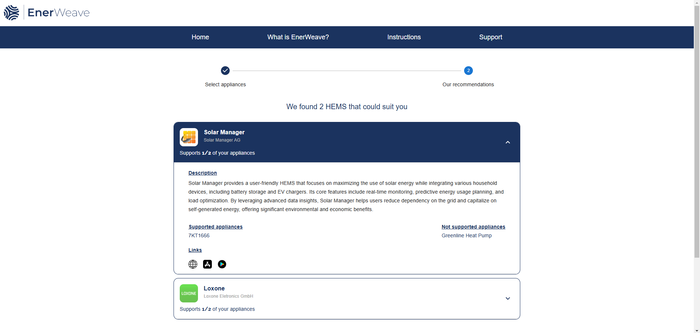

# HEMS-finder

HEMS finder application school project, that was made in collaboration with students from Hochschule München University of Applied Sciences. 
Projects client was a German company SPiNE Energy. Application is in further development at the client.

Applications main function is to suggest to user best possible home energy management system (HEMS), which supports as many as possible appliances the user has or is considering to acquire.

User can choose aplliances they want from dopdown menus and filter the selection with filter options. 

User sees HEMS recommendations based on their appliance choises. Application shows recommendation, that supports all or as many as possible appliances first 
and after that other HEMS that may support fewer choises.

## Tech, Libraries and Tools

**Backend
- Spring Boot(Maven, Java 21)

**Frontend
- React
- SCSS, Vite, npm

**Database
- PostreSQL

**Version Control
- Git/GitLab

**Cloud
- AWS (ECR, ECS, EFS)

**Other
- Figma
- Docker
